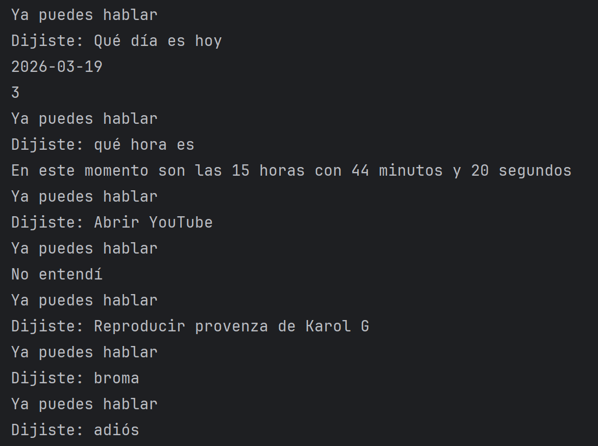

# Asistente Virtual en Python

Asistente por voz desarrollado en Python que interpreta comandos hablados y ejecuta acciones en tiempo real.

---

## Funcionalidades

- Reconocimiento de voz  
- Síntesis de voz  
- Búsqueda en Wikipedia  
- Reproducción en YouTube  
- Apertura de páginas web  
- Consulta de hora  

---

## Tecnologías

Python · speech_recognition · pyttsx3 · pywhatkit · wikipedia

---

## Descripción técnica

El sistema captura audio desde el micrófono, convierte la voz a texto, procesa el comando y ejecuta la acción correspondiente, generando una respuesta mediante síntesis de voz.

---

## Autor

Aiko Marín
